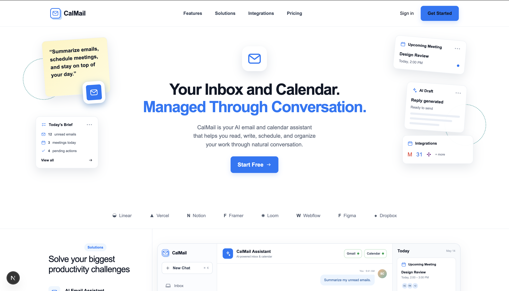
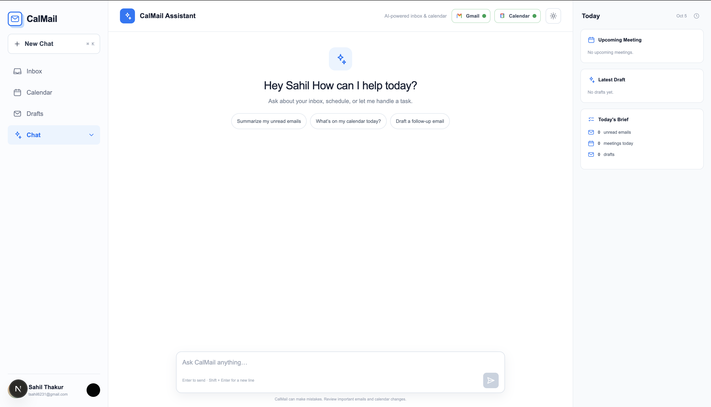
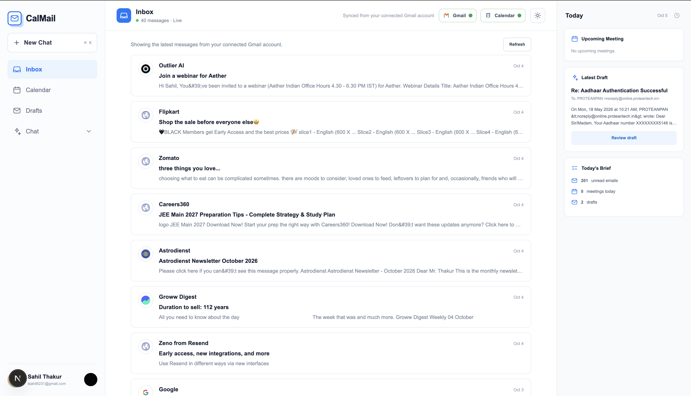
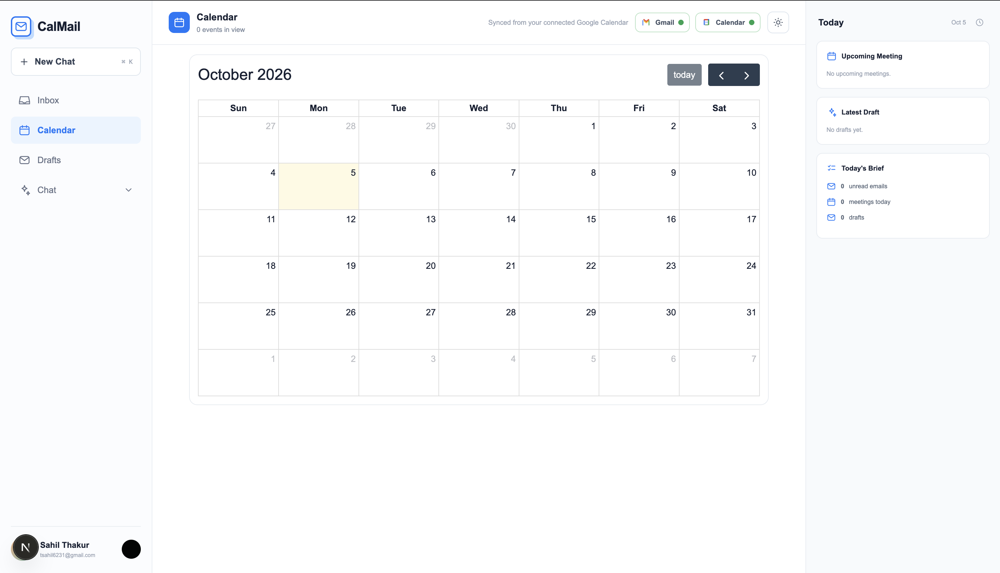

# CalMail

CalMail is an AI-powered email and calendar workspace built for the Corsair hackathon. It combines a polished Next.js interface with an Express API, Clerk authentication, OpenAI Agents, Corsair Gmail and Google Calendar integrations, and a Drizzle/Postgres data layer so users can manage messages, schedules, drafts, and tasks through natural conversation.

## Preview

### Landing Page



### AI Chat Interface



### Inbox



### Calendar



## Features

- AI assistant for email and calendar workflows
- Gmail inbox, message body, draft, and send support through Corsair
- Google Calendar event listing and creation
- Conversation history persisted in Postgres
- Clerk-based authentication across web and API
- Server-sent events support for live server updates
- Shared Drizzle schema and database client package
- Turborepo monorepo with shared TypeScript, ESLint, and UI packages

## Tech Stack

| Area | Technology |
| --- | --- |
| Monorepo | Turborepo, pnpm workspaces |
| Web | Next.js 16, React 19, Tailwind CSS 4 |
| API | Express 5, TypeScript, Zod |
| Auth | Clerk |
| AI | OpenAI Agents SDK |
| Integrations | Corsair Gmail, Corsair Google Calendar |
| Database | Postgres, Drizzle ORM |
| Tooling | ESLint, Prettier, TypeScript |

## Project Structure

```text
corsair-hackathon/
├── apps/
│   ├── api/                 # Express API, controllers, routes, AI agent, integrations
│   ├── docs/                # Next.js docs app scaffold
│   └── web/                 # Main CalMail Next.js application
│       ├── app/             # App Router pages and layouts
│       ├── lib/             # API client helpers
│       └── public/images/   # Product screenshots used in this README
├── packages/
│   ├── database/            # Drizzle schema, migrations, database client
│   ├── eslint-config/       # Shared lint configuration
│   ├── typescript-config/   # Shared tsconfig presets
│   └── ui/                  # Shared React UI primitives
├── pnpm-workspace.yaml
├── turbo.json
└── package.json
```

## Application Modules

### Web App

The main UI lives in `apps/web`. It includes:

- Marketing landing page at `/`
- Authenticated chat shell under `/chat`
- Inbox views under `/chat/inbox`
- Drafts, calendar, contacts, and tasks routes
- Clerk provider, theme provider, and Axios API client

### API

The backend lives in `apps/api`. It exposes:

- `GET /health` for API health checks
- `/auth` for OAuth and connection flows
- `/ai` for conversations and AI responses
- `/gmail` for Gmail-backed inbox and draft actions
- `/calendar` for Google Calendar actions
- `/overview` for workspace summary data
- `/sse` for server-sent events
- `/webhooks` for Corsair webhook handling

### Database

The database package in `packages/database` defines Drizzle tables for:

- users
- connected accounts
- Corsair integrations, accounts, entities, and events
- email threads and messages
- AI conversations and messages

## Getting Started

### Prerequisites

- Node.js 18 or newer
- pnpm 9
- Postgres database connection string
- Clerk application keys
- OpenAI API key
- Google OAuth credentials
- Corsair credentials/configuration

### Install Dependencies

```bash
pnpm install
```

### Environment Variables

Create the required `.env` files based on how the app loads configuration. The API reads from the workspace root, `packages/.env`, and `apps/api/.env`.

```bash
# API / database
DATABASE_URL=
OPENAI_API_KEY=
OPENAI_MODEL=gpt-4o-mini
CORSAIR_KEK=
CORSAIR_TENANT_ID=
GOOGLE_CLIENT_ID=
GOOGLE_CLIENT_SECRET=
CLERK_SECRET_KEY=
CLERK_PUBLISHABLE_KEY=
WEB_ORIGIN=http://localhost:3000
API_PUBLIC_ORIGIN=http://localhost:4000
WEBHOOK_URL=
PORT=4000

# Web
NEXT_PUBLIC_API_URL=http://localhost:4000
NEXT_PUBLIC_CLERK_PUBLISHABLE_KEY=
```

### Run Locally

Start every app in development mode:

```bash
pnpm dev
```

Run a specific app:

```bash
pnpm --filter web dev
pnpm --filter @repo/api dev
```

By default, the web app runs on `http://localhost:3000` and the API runs on `http://localhost:4000`.

## Useful Scripts

```bash
pnpm dev          # Start all development servers through Turborepo
pnpm build        # Build all apps and packages
pnpm lint         # Run lint checks
pnpm check-types  # Run TypeScript checks
pnpm format       # Format TypeScript, TSX, and Markdown files
```

## Architecture

CalMail uses the Next.js app as the client-facing workspace and routes authenticated API requests to the Express backend. Clerk provides identity, the API validates requests with Zod, and Drizzle stores user data, connected accounts, email metadata, and conversation history. The OpenAI agent receives the user request plus prior conversation context and can call purpose-built tools for Gmail and Calendar actions through Corsair.

```text
User
  ↓
Next.js Web App
  ↓ authenticated Axios requests
Express API
  ├── Clerk auth middleware
  ├── OpenAI agent orchestration
  ├── Corsair Gmail and Calendar tools
  └── Drizzle/Postgres persistence
```

## Notes

- Screenshot assets are stored in `apps/web/public/images`.
- The repository still includes generated folders such as `.next`, `dist`, and `.turbo`; these are build artifacts and are not part of the source architecture.
- The docs app is currently the default Turborepo/Next.js scaffold, while `apps/web` contains the primary CalMail product experience.
